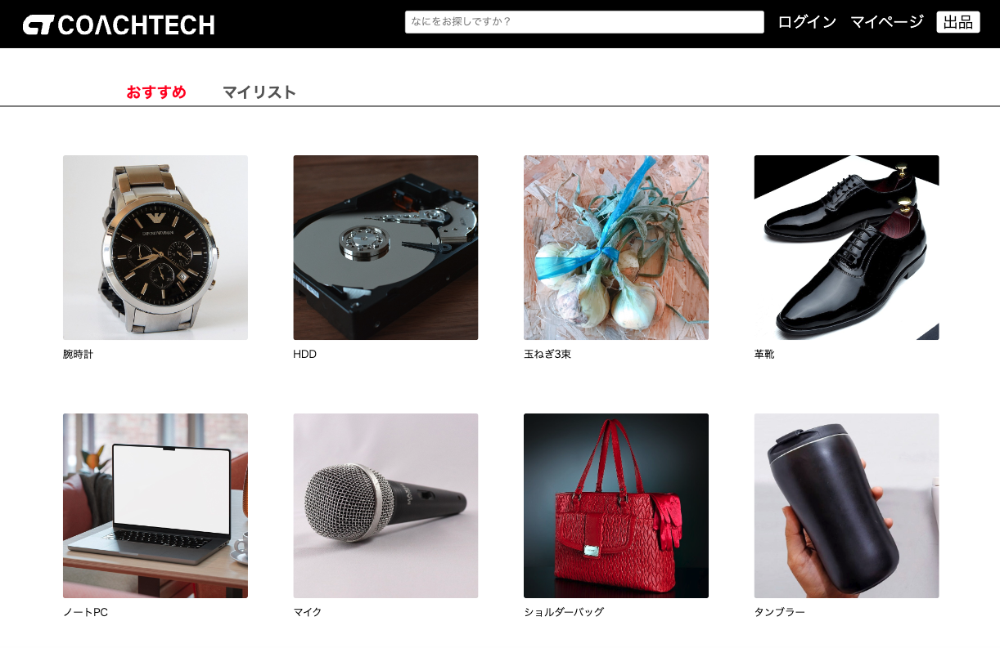
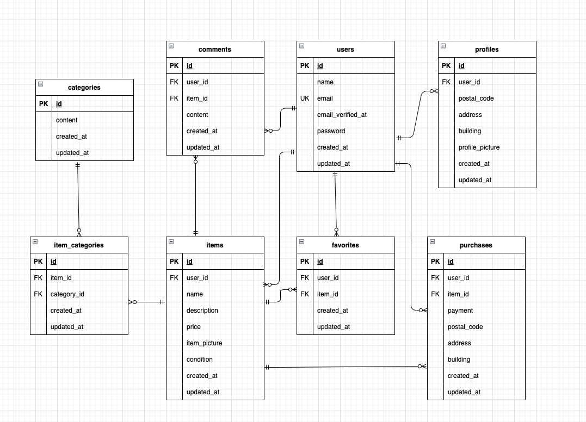

# coachtech フリマアプリ
**様々な商品が出品されています   
ログイン後、商品の出品や購入、コメントの投稿などができます**  


## 機能一覧
- 新規登録機能
- ログイン・ログアウト機能
- プロフィール登録機能
- 配送先変更機能
- メール認証機能
- 決済機能
- いいね機能
- コメント送信機能
- 商品の出品・購入機能
- 商品の検索機能

## 使用技術(実行環境)
- PHP 7.4.9
- Laravel 8.83.8
- MySQL 8.0.26
- javascript
- laravel-fortify
- stripe

## ER図


## 環境構築
**Dockerビルド**
1. git clone git@github.com:cote07/fleamarket.git
2. cd fleamarket
3. docker-compose up -d --build

**Laravel環境構築**
1. docker-compose exec php bash
2. composer install
3. cp .env.example .env
4. .envに以下の環境変数を追加
   >  MAIL_USERNAME,  MAIL_PASSWORD,  MAIL_FROM_ADDRESS には自身で用意したmailtrapの情報を設定してください
   >  STRIPE_KEY,  STRIPE_SECRET　には自身で用意したstripeの情報を設定してください
``` text
APP_NAME=coachtechフリマアプリ
```
``` text
DB_CONNECTION=mysql
DB_HOST=mysql
DB_PORT=3306
DB_DATABASE=laravel_db
DB_USERNAME=laravel_user
DB_PASSWORD=laravel_pass
```
``` text
MAIL_MAILER=smtp
MAIL_HOST=smtp.mailtrap.io
MAIL_PORT=2525
MAIL_USERNAME=
MAIL_PASSWORD=
MAIL_ENCRYPTION=null
MAIL_FROM_ADDRESS=
MAIL_FROM_NAME="${APP_NAME}"
```
``` text
STRIPE_KEY=
STRIPE_SECRET=
```
5. php artisan key:generate
6. php artisan migrate
7. php artisan db:seed
8. php artisan storage:link
    >  権限付与が必要な場合は下記のコマンドを実行してください
    ``` text
    chmod -R 775 storage
    chmod -R 775 bootstrap/cache
    ```

**URL**
- 開発環境：http://localhost/
- phpMyAdmin：http://localhost:8080/

## PHPunitテスト
1. docker-compose exec php bash
2. php artisan key:generate --env=testing
3. php artisan migrate --env=testing
4. vendor/bin/phpunit --testdox tests/Feature
